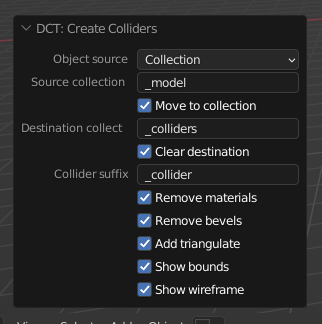

# DCL Collider Toolkit

A minimal addon for Blender that lets you easily duplicate a collection and convert it to colliders suitable for Decentraland.

It allow the user to easily trigger a series of repetitive tasks performed to create colliders for use in Decentraland:

* **Clone** a selection/collection of objects
* **Move** the clones to their own collection
* Add **triangulate** modifier
* Remove **materials**
* Remove **bevels** modifier
* Remove existing colliders
* Append the appropriate `_collider` **suffix**
* Show **wireframe**
* Show **bounding boxes**

This addon was justified by [xkcd/1205](https://xkcd.com/1205/).
# Use

Download from the [Releases](https://github.com/stom66/blender-addon-dcl-collider-toolkit/releases) page. Requires Blender 2.93 or later. 

**Note there is no UI/Panel for this**. 

Search with F3 for "DCT" and run "DCT: Create Colliders"

# Known Issues

* Blender crashes when there are too many existing colliders. Be sure to save before running the tool. If it crashes, manually remove everything from the `_colliders` collection and run it again.

# License

The code in this addon is licensed under the GNU General Public License v3.0.  Please see [LICENSE.md](LICENSE.md) for details.

# Contributing

Although I am not specifically looking for contributions right now, if you would like to contribute please keep in mind the following things:

- This was a quick-n-dirty plugin I have no particular plans to develop further, and is primarily intended for internal use.
- By submitting any work for inclusion in this addon, you agree to license it under the same terms as above, and you assert that you have the rights to do so.
- Larger changes to the addon are likely to be rejected unless by pure coincidence they happen to align with our goals for the project.  So if you are considering a larger change, please either file an issue or otherwise contact us to discuss your idea before starting work on it, so that you don't inadvertantly waste your time.